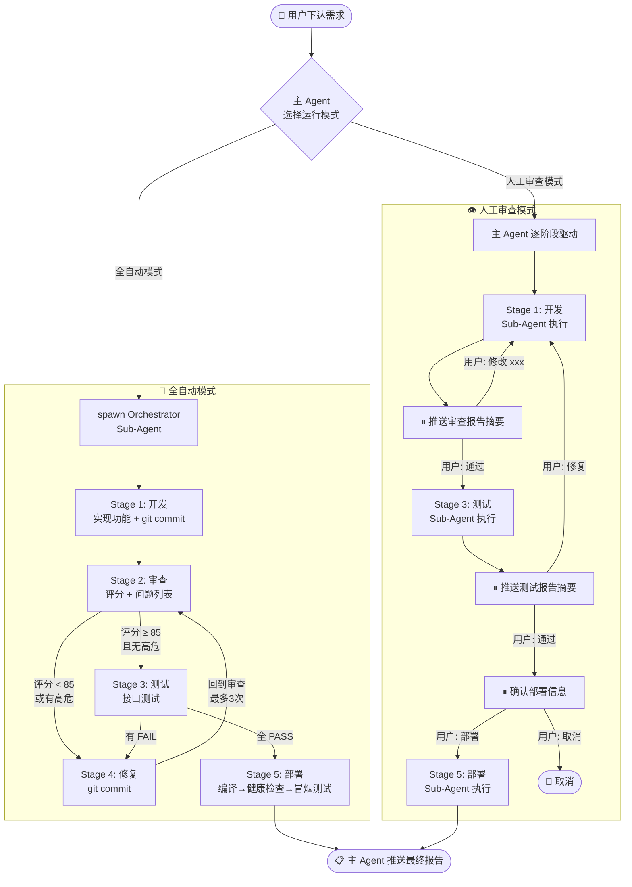
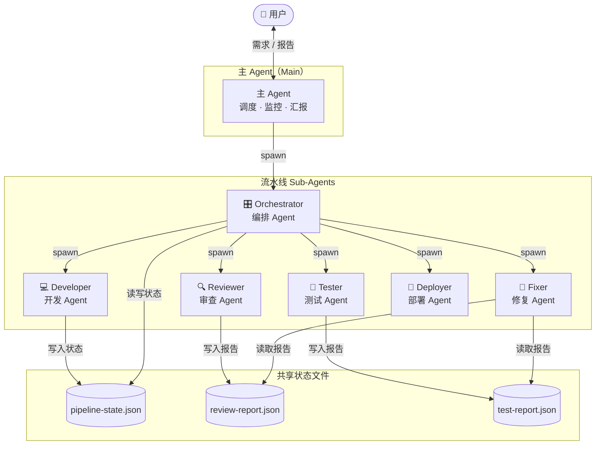
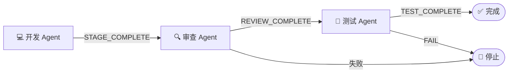
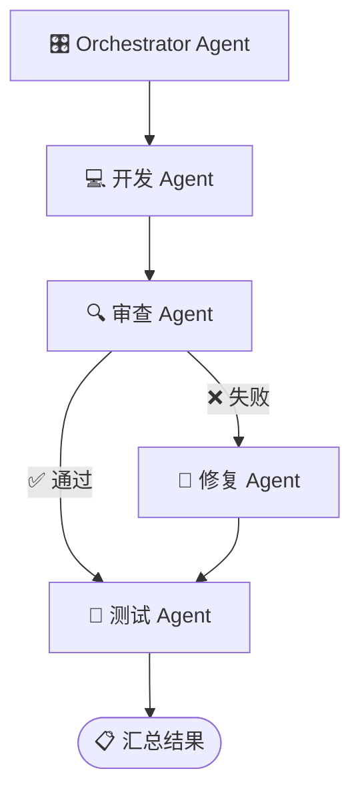
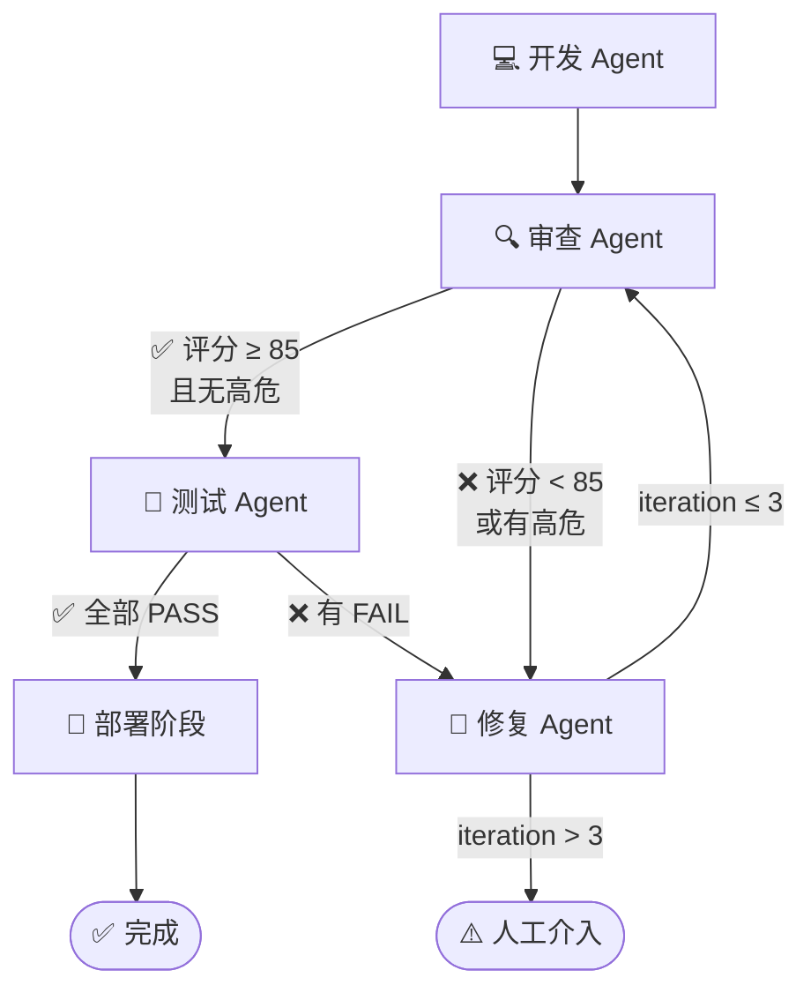
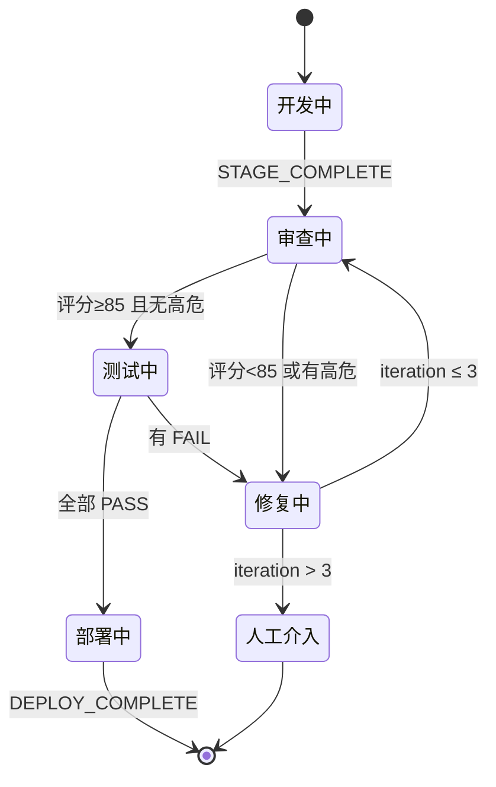
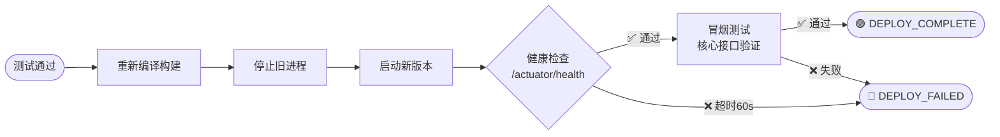
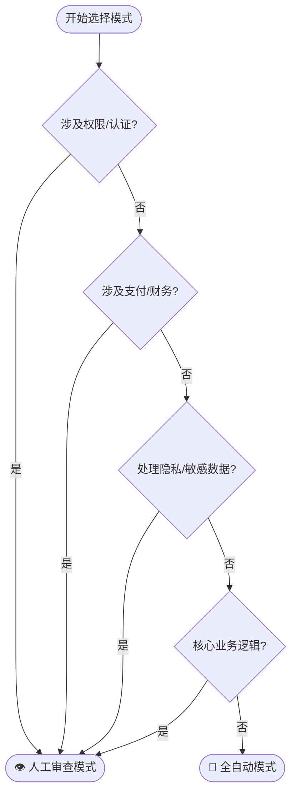

# 多 Agent 协同开发方法论

> 本方法论适用于任何想通过 OpenClaw 搭建多 Agent 自动化开发流水线的工程师。

---

## 0. 完整流水线总览

### 0.1 两种运行模式全局视图



### 0.2 两种模式对比

| 维度 | 全自动模式 | 人工审查模式 |
|------|-----------|------------|
| 适用场景 | 普通 CRUD、非核心功能 | 权限/支付/隐私/核心业务 |
| 用户介入 | 仅最终结果 | 审查/测试/部署三个节点 |
| 执行方式 | 单一 Orchestrator Sub-Agent | 主 Agent 逐阶段驱动 |
| 灵活性 | 固定流程 | 可随时调整方向 |


---

## 1. 核心原则

### 1.1 主 Agent 响应原则

主 Agent 是用户交互的唯一入口，必须时刻保持对用户的响应能力。

**核心规则：**
- 所有预计超过 10 秒的任务，必须交给 Sub-Agent 执行
- 主 Agent 只负责：调度、监控、汇报、用户交互
- 禁止在主线程执行：编译、构建、长时间 API 调用、复杂代码生成

**正确示例：**
```
用户：帮我实现用户登录功能
主 Agent：收到，已启动开发流水线（Stage 1/4），完成后通知你
         → spawn sub-agent 执行开发任务
         → 主线程立即释放，可响应用户其他消息
```

**错误示例：**
```
用户：帮我实现用户登录功能
主 Agent：[开始生成代码...] [阻塞 2 分钟]
         → 用户发送的其他消息堆积，无响应
```

### 1.5 流水线自动推进原则（⚠️ 关键）

**Sub-Agent 完成后，主 Agent 必须自动推进到下一阶段，无需等待用户询问。**

**工作机制：**

当 Sub-Agent 完成任务后，OpenClaw 会以消息形式将结果**推送**给主 Agent（就像收到用户消息一样）。主 Agent 收到这条推送后，必须立即执行下一阶段，而不是被动等待用户说"继续"。

**主 Agent 收到 Sub-Agent 完成消息后的标准处理流程：**

```
1. 识别完成标记（STAGE_COMPLETE / DEPLOY_COMPLETE 等）
2. 读取 pipeline-state.json，确认当前阶段
3. 执行条件判断（是否通过质量门控）
4. 立即 spawn 下一阶段的 Sub-Agent
5. 更新 pipeline-state.json（标记当前阶段 done，写入 nextStage）
6. 通知用户："✅ Stage N 完成，已自动启动 Stage N+1"
```

**⚠️ 常见错误：**
```
❌ 错误：收到 STAGE_COMPLETE 后，等待用户说"继续"或"下一步"
❌ 错误：收到 STAGE_COMPLETE 后，只回复"已完成"，不启动下一阶段
✅ 正确：收到 STAGE_COMPLETE 后，立即读取状态 → 判断 → spawn 下一阶段
```

**为什么容易犯这个错误：**

AI 模型的默认行为是"完成一件事后等待指令"。在多 Agent 流水线场景下，需要**显式覆盖**这个默认行为：主 Agent 收到 Sub-Agent 完成消息，本质上就是"下一步的触发信号"，应当立即响应执行，而不是向用户汇报后等待。

---

### ⚠️ 通知机制的可靠性问题（重要！）

> **实践教训（2026-03-08）**：`STAGE_COMPLETE` 推送并不总是可靠。
> Sub-Agent 在子进程中执行 `openclaw system event` 时可能静默失败，导致主 Agent 永远等不到通知，流水线卡死，用户也收不到任何反馈。

**必须采用双保险机制：**

```
方式A：Sub-Agent 主动推送（不可靠，辅助）
  → Sub-Agent 输出 STAGE_COMPLETE
  → 执行 openclaw system event 或 message 工具发通知
  ⚠️ 子进程环境中可能失败

方式B：主 Agent 心跳轮询（可靠，主要保障）
  → 心跳间隔设为 5 分钟（流水线执行期间）
  → 每次心跳：subagents(action=list) 检查状态
  → 发现 done 未推进 → 立即推进
  → 发现超时卡死 → kill + 告警用户
```

**HEARTBEAT.md 必须包含流水线监控逻辑（不能只靠推送）：**

```markdown
## 流水线监控（每次心跳必查）
- subagents(action=list) 检查所有 active sub-agent
- 运行超过 10 分钟 → 检查最后消息时间
- 最后消息超过 5 分钟无更新 → 判定卡死，kill + 通知
- 运行超过 30 分钟 → 直接 kill + 通知
- 检查 pipeline-state.json：有 done 但未推进的 Stage → 立即推进
```

**在 Prompt 中必须明确写出：**
```
当你收到任何 Sub-Agent 的完成消息（包含 STAGE_COMPLETE）时：
- 立即读取 pipeline-state.json
- 立即计算下一阶段
- 立即 spawn 下一阶段的 Sub-Agent
- 无需等待用户确认
```

### 1.2 角色分工原则

每个 Agent 只做一件事，职责边界清晰。

**为什么：**
- 不同任务需要不同的模型能力（代码生成 vs 推理审查）
- 单一职责便于 Prompt 优化和问题定位
- 避免 token 超限（复杂任务拆分后更可控）

**角色定义方式：**
- 明确输入：从哪里读取任务描述、配置文件
- 明确输出：产出文件路径、格式、结束标记
- 禁止越界：开发 Agent 不做审查，审查 Agent 不写代码

### 1.3 质量门控原则

代码不达标不合并，通过循环保证质量。

**三级门控：**
1. **静态审查**：代码风格、潜在漏洞、最佳实践
2. **自动化测试**：单元测试、接口测试、集成测试
3. **修复循环**：问题修复后重新审查/测试，直到通过

**熔断机制：**
- 最大循环次数：3 次
- 超过限制后：停止流水线，人工介入

### 1.4 可观测原则

每个 Agent 的输出都要写入可追溯的文件。

**文件规范：**
```
<YOUR_PROJECT_DIR>/tasks/
├── pipeline-state.json      # 流水线状态（当前阶段、进度）
├── reports/
│   ├── review-stage1.json   # 审查报告
│   └── test-stage1.json     # 测试报告
└── artifacts/
    └── <generated-files>    # 生成的代码文件
```

**状态文件示例：**
```json
{
  "pipelineId": "feature-user-login",
  "currentStage": 2,
  "stages": [
    { "name": "develop", "status": "done", "model": "<YOUR_MODEL>" },
    { "name": "review", "status": "running", "model": "<YOUR_REVIEW_MODEL>" },
    { "name": "test", "status": "pending" },
    { "name": "fix", "status": "pending" }
  ],
  "iteration": 1
}
```

---

## 2. Agent 角色体系

### 2.0 角色关系架构图



### 2.1 开发 Agent（Developer）

| 属性 | 描述 |
|------|------|
| **职责** | 根据需求文档生成代码、编写测试用例 |
| **输入** | 需求描述、技术栈配置、项目结构 |
| **输出** | 源代码文件、单元测试文件 |
| **推荐模型特性** | 代码生成能力强、支持多语言、上下文窗口大 |
| **结束标记** | `STAGE_COMPLETE` |

### 2.2 审查 Agent（Reviewer）

| 属性 | 描述 |
|------|------|
| **职责** | 静态代码审查、识别潜在问题、生成审查报告 |
| **输入** | 待审查的代码文件、审查规则配置 |
| **输出** | 审查报告（JSON 格式，含评分、问题列表） |
| **推荐模型特性** | 推理深度强、安全意识高、中文理解好 |
| **结束标记** | `REVIEW_COMPLETE` |

**审查维度：**
- 代码质量（命名、结构、可读性）
- 安全漏洞（SQL 注入、XSS、敏感信息泄露）
- 性能问题（N+1 查询、内存泄漏风险）
- 最佳实践（设计模式、错误处理）

### 2.3 测试 Agent（Tester）

| 属性 | 描述 |
|------|------|
| **职责** | 执行自动化测试、生成测试报告 |
| **输入** | 测试配置、接口文档、测试数据 |
| **输出** | 测试报告（通过率、失败用例详情） |
| **推荐模型特性** | 执行速度快、支持命令行操作 |
| **结束标记** | `TEST_COMPLETE` |

**测试类型：**
- 单元测试（由开发 Agent 生成）
- 接口测试（HTTP 请求验证）
- 集成测试（端到端流程）

### 2.4 修复 Agent（Fixer）

| 属性 | 描述 |
|------|------|
| **职责** | 根据审查/测试报告修复问题 |
| **输入** | 问题报告（审查报告或测试报告） |
| **输出** | 修复后的代码、修复说明 |
| **推荐模型特性** | 代码生成能力强、理解问题上下文 |
| **结束标记** | `FIX_COMPLETE` |

### 2.5 编排 Agent（Orchestrator）

| 属性 | 描述 |
|------|------|
| **职责** | 协调多个 Agent 按流水线执行、监控进度、决策下一步 |
| **输入** | 流水线配置、任务描述 |
| **输出** | 流水线状态更新、最终结果汇总 |
| **推荐模型特性** | 推理能力强、决策能力好、响应速度快 |
| **结束标记** | `PIPELINE_COMPLETE` |

### 2.6 部署 Agent（Deployer）

| 属性 | 描述 |
|------|------|
| **职责** | 编译构建、部署服务、健康检查、冒烟测试 |
| **输入** | 构建配置、部署目标、健康检查接口 |
| **输出** | 部署结果（服务地址、版本号、部署时间） |
| **推荐模型特性** | 执行速度快、命令行操作熟练 |
| **结束标记** | `DEPLOY_COMPLETE` |

**部署流程：**
1. 重新编译构建（`mvn clean package` / `npm run build`）
2. 停止旧进程
3. 启动新版本
4. 健康检查（`/actuator/health`，超时 60s）
5. 冒烟测试（核心接口验证）

**失败处理：**
- 健康检查超时 → `DEPLOY_FAILED`，通知人工介入
- 冒烟测试失败 → `DEPLOY_FAILED`，回滚或人工排查

---

## 3. 流水线模式

### 3.1 接力模式

**适用场景：** 简单任务，一次性执行，无需循环



**特点：**
- 各阶段顺序执行
- 任意阶段失败则停止
- 适合快速验证、原型开发

### 3.2 Orchestrator 模式

**适用场景：** 复杂任务，全自动执行，支持条件分支



**特点：**
- Orchestrator Agent 负责调度
- 根据审查结果决定下一步
- 支持并行执行（多个独立任务）

### 3.3 循环模式

**适用场景：** 质量要求高，需要多次迭代



**循环规则：**
- 审查不通过 → 修复 → 重新审查
- 测试不通过 → 修复 → 重新审查 → 重新测试
- 最大循环次数：3 次
- 超过限制 → 停止，人工介入

**状态机视图：**



**状态追踪：**
```json
{
  "iteration": 2,
  "maxIterations": 3,
  "stageHistory": [
    { "stage": "develop", "status": "done" },
    { "stage": "review", "status": "failed", "score": 72 },
    { "stage": "fix", "status": "done" },
    { "stage": "review", "status": "passed", "score": 88 },
    { "stage": "test", "status": "failed", "passRate": "60%" }
  ]
}
```

### 3.4 部署阶段

**适用场景：** 所有模式，测试通过后的最后阶段



**部署 Agent（Deployer）职责：**

| 属性 | 描述 |
|------|------|
| **职责** | 编译构建、服务部署、健康检查、冒烟测试 |
| **输入** | 代码仓库、部署配置、环境信息 |
| **输出** | 部署报告（版本号、服务地址、启动时间） |
| **推荐模型特性** | 执行速度快、命令行操作能力强 |
| **结束标记** | `DEPLOY_COMPLETE` 或 `DEPLOY_FAILED` |

**部署报告格式：**
```json
{
  "version": "v1.2.3",
  "commit": "abc123",
  "environment": "staging",
  "serviceUrl": "http://localhost:8080",
  "deployTime": "2024-01-15T10:30:00Z",
  "healthCheck": "passed",
  "smokeTest": "passed",
  "status": "success"
}
```

### 3.5 运行模式选择

在开发任务启动前，需根据功能特性选择运行模式。

#### 模式选择决策树



#### 模式 A - 全自动模式

**适用场景：** 低风险/非核心功能

**特点：**
- 单一 Orchestrator Sub-Agent 跑完所有阶段
- 主 Agent 只在最终完成时通知用户
- 流程：开发 → 审查 → 测试 → 部署（全自动）

**适用场景：**
- CRUD 功能
- 配置项修改
- 非敏感数据处理
- UI 调整

#### 模式 B - 人工审查模式

**适用场景：** 高风险/核心/敏感功能

**特点：**
- 主 Agent 逐阶段驱动，每个关键节点暂停等待人工确认
- 用户可在每个暂停点查看报告，决定"继续"或"指定修改方向"
- 流程：开发 → 审查报告 → **暂停** → 测试报告 → **暂停** → 部署前 → **暂停** → 部署

**暂停点：**
1. **审查报告生成后** - 用户可查看评分和问题，决定是否进入测试
2. **测试报告生成后** - 用户可查看通过率，决定是否进入部署
3. **部署前** - 用户确认版本信息，决定是否执行部署

**适用场景：**
- 权限/认证相关功能
- 支付/财务功能
- 用户隐私数据处理
- 核心业务逻辑

#### 模式选择决策矩阵

| 功能类型 | 涉及数据 | 推荐模式 | 原因 |
|---------|---------|---------|------|
| 普通 CRUD | 非敏感 | 全自动 | 风险低，影响范围可控 |
| 权限/登录 | 用户凭证 | 人工审查 | 安全敏感，需人工把关 |
| 财务/支付 | 金额数据 | 人工审查 | 业务敏感，错误代价高 |
| 配置/参数 | 系统配置 | 全自动 | 影响范围明确，回滚容易 |
| 数据导出 | 可能含敏感信息 | 人工审查 | 数据泄露风险 |
| 用户管理 | 个人信息 | 人工审查 | 隐私合规要求 |
| 日志/监控 | 系统日志 | 全自动 | 无敏感数据，风险低 |

---

## 4. 模型选型方法论

### 4.1 按任务维度评估

| 维度 | 开发 Agent | 审查 Agent | 测试 Agent | 修复 Agent | Orchestrator |
|------|-----------|-----------|-----------|-----------|--------------|
| 代码生成能力 | ⭐⭐⭐⭐⭐ | ⭐⭐ | ⭐ | ⭐⭐⭐⭐ | ⭐ |
| 推理深度 | ⭐⭐⭐ | ⭐⭐⭐⭐⭐ | ⭐⭐ | ⭐⭐⭐⭐ | ⭐⭐⭐⭐⭐ |
| 中文理解 | ⭐⭐⭐⭐ | ⭐⭐⭐⭐⭐ | ⭐⭐⭐ | ⭐⭐⭐⭐ | ⭐⭐⭐⭐ |
| 响应速度 | ⭐⭐⭐ | ⭐⭐⭐ | ⭐⭐⭐⭐⭐ | ⭐⭐⭐ | ⭐⭐⭐⭐⭐ |

**选型建议：**
- 开发 Agent：优先代码生成能力，其次上下文窗口大小
- 审查 Agent：优先推理深度和中文理解，确保问题识别准确
- 测试 Agent：优先响应速度，执行预定义的测试脚本
- 修复 Agent：平衡代码生成和问题理解能力
- Orchestrator：优先推理和决策能力，响应速度次之

### 4.2 验证模型白名单

使用 `sessions_spawn` 发送简单测试，验证模型可用性：

```json
{
  "command": "echo 'Model test successful'",
  "env": ["MODEL_NAME=<YOUR_MODEL_TO_TEST>"],
  "runtime": "openclaw",
  "model": "<YOUR_MODEL_TO_TEST>"
}
```

**验证步骤：**
1. 准备候选模型列表
2. 对每个模型发送测试任务
3. 记录响应时间、成功率
4. 选择表现最佳的模型加入白名单

### 4.3 成本与质量平衡

**分层策略：**

| 任务类型 | 推荐模型层级 | 原因 |
|---------|-------------|------|
| 简单开发任务 | 轻量级模型 | 成本低，速度够用 |
| 复杂业务逻辑 | 中级模型 | 平衡成本和质量 |
| 核心模块审查 | 高级模型 | 质量优先，成本其次 |
| 简单测试执行 | 轻量级模型 | 执行命令行，无需推理 |
| Orchestrator | 中级模型 | 决策复杂度中等 |

**动态切换：**
- 初始使用轻量级模型
- 检测到质量问题时升级模型
- 通过后回退轻量级模型

### 4.4 降级策略（⚠️ 必须配置）

**每个角色都必须配置 `fallback` 降级模型**，当主模型不可用时自动切换，避免整条流水线因单个模型故障中断。

**推荐降级配置表：**

| 角色 | 首选模型 | 降级模型 | 说明 |
|------|---------|---------|------|
| Orchestrator | Claude Sonnet | GLM | 推理能力接近，可替代决策 |
| Developer | Claude Sonnet | Qwen3-Coder | 同样擅长代码生成 |
| Reviewer | GLM | Claude Sonnet | 推理深度互补 |
| Tester | Claude Haiku | GLM | 执行速度均可 |
| Fixer | Claude Sonnet | Qwen3-Coder | 代码修复能力接近 |
| Deployer | Claude Haiku | GLM | 命令行执行均可 |

**降级触发条件：**
- API 返回 503 / 429（服务不可用 / 限流）
- 连续 3 次请求超时
- 模型返回明显异常（拒绝执行、输出乱码）

**降级处理流程：**
```
主模型请求失败
    ↓
自动切换到 fallback 模型重试（同一任务，不重置状态）
    ↓
fallback 成功 → 继续流水线，在报告中标注「已降级执行」
    ↓
fallback 也失败 → 停止流水线，通知用户：
  "⚠️ Stage N 模型全部不可用（主模型: XXX，降级模型: YYY），请介入处理"
```

**在 agent-roles.json 中的配置方式：**
```json
{
  "roles": {
    "developer": {
      "model": "anthropic/claude-4.5-sonnet",
      "fallback": "anthropic/qwen3-coder-plus",
      "description": "代码生成，主模型不可用时降级到 Qwen3-Coder"
    }
  }
}
```

---

## 5. 质量标准

### 5.1 审查通过门槛

**评分标准：**
```
评分 = 基础分(60) + 代码质量(+15) + 安全性(+15) + 性能(+10)

代码质量：命名规范、结构清晰、注释完整
安全性：无高危漏洞、无中危漏洞（或有充分理由保留）
性能：无 N+1 查询、无内存泄漏风险
```

**通过条件：**
- 总评分 ≥ 85 分
- 无高危问题
- 中危问题 ≤ 2 个

### 5.2 测试通过门槛

**通过条件：**
- 所有测试用例 PASS
- 测试覆盖率 ≥ 80%（可选配置）
- 无阻塞性 Bug

**测试报告格式：**
```json
{
  "totalCases": 15,
  "passed": 15,
  "failed": 0,
  "passRate": "100%",
  "coverage": "82%",
  "details": [
    { "name": "test_user_login", "status": "PASS", "duration": "0.5s" }
  ]
}
```

### 5.3 最大循环次数

**限制原因：**
- 防止无限循环消耗资源
- 强制人工介入，避免低质量代码反复修复

**配置建议：**
```json
{
  "maxIterations": 3,
  "iterationCooldown": 60,
  "escalation": {
    "onMaxIterations": "notify_user",
    "channel": "<YOUR_NOTIFICATION_CHANNEL>"
  }
}
```

---

## 6. 踩坑与最佳实践

### 6.1 主 Agent 阻塞问题

**问题表现：**
- 主 Agent 执行长时间任务时无响应
- 用户消息堆积，体验差
- 流水线卡在某个阶段

**解决方案：**
1. 所有耗时任务必须 spawn sub-agent
2. 设置任务超时时间
3. 主 Agent 定期检查 sub-agent 状态

**代码示例：**
```json
// 正确做法：spawn sub-agent
{
  "action": "spawn",
  "command": "<YOUR_LONG_RUNNING_TASK>",
  "model": "<YOUR_MODEL>",
  "timeout": 300
}
```

### 6.2 Sub-Agent 卡死监控

**问题表现：**
- Sub-Agent 长时间无输出
- 状态显示 running 但实际已停止
- 资源泄漏

**监控方案：**
1. 设置心跳检查（每 30 秒）
2. 设置最大执行时间（如 10 分钟）
3. 超时后自动终止并重启

**监控脚本：**
```bash
# 检查运行超过 10 分钟的 sub-agent
openclaw sessions list --status running --older-than 600
```

### 6.3 Prompt 编写原则

**原则 1：明确输入输出**

```
❌ 错误：帮我审查代码
✅ 正确：审查 <YOUR_PROJECT_DIR>/src/ 目录下的所有 .java 文件，
        输出报告到 <YOUR_PROJECT_DIR>/tasks/reports/review.json
        格式：{ "score": 85, "issues": [...] }
```

**原则 2：禁止询问确认**

```
❌ 错误：请确认是否继续？
✅ 正确：不询问确认，直接执行所有步骤
```

**原则 3：要求输出结束标记**

```
✅ 正确：任务完成后输出 STAGE_COMPLETE，便于主 Agent 检测
```

**完整 Prompt 模板：**
```
你是 <YOUR_ROLE>。

项目目录：<YOUR_PROJECT_DIR>
输入文件：<YOUR_INPUT_FILES>
输出文件：<YOUR_OUTPUT_FILES>

任务：<YOUR_TASK_DESCRIPTION>

要求：
1. 不询问确认，直接执行
2. 完成后输出 STAGE_COMPLETE
3. 错误时输出 ERROR: <错误信息>
```

### 6.4 任务拆分原则

**问题表现：**
- 单个 Sub-Agent 任务过大，token 超限
- 任务复杂，执行时间过长
- 错误难以定位

**拆分规则：**
1. 一个 Sub-Agent 只做一件事
2. 单个任务 token 消耗 < 50,000
3. 单个任务执行时间 < 10 分钟

**拆分示例：**

```
❌ 错误：一个 Sub-Agent 完成所有模块开发
✅ 正确：
  - Sub-Agent 1：开发用户模块
  - Sub-Agent 2：开发订单模块
  - Sub-Agent 3：开发支付模块
  - Orchestrator：汇总结果
```

### 6.5 状态文件管理

**问题表现：**
- 多个 Agent 同时写入同一文件
- 状态文件损坏或格式错误
- 历史状态丢失

**解决方案：**
1. 使用原子写入（先写临时文件，再 rename）
2. 每次更新前备份旧状态
3. 使用 JSON Schema 校验格式

```bash
# 原子写入示例
cat > /tmp/pipeline-state.json.new << EOF
<new_content>
EOF
mv /tmp/pipeline-state.json.new /path/to/pipeline-state.json
```

### 6.6 Docker + MySQL 中文乱码问题

**问题表现：**
- 接口返回中文字段显示乱码（如 `超级管ç†å'˜` 而非 `超级管理员`）
- 数据库中 `HEX(field)` 显示双重 UTF-8 编码（如 `C3A8C2B6...`）
- MySQL 容器 `SHOW VARIABLES LIKE 'character%'` 显示 `character_set_client=latin1`

**根本原因：**

SQL 初始化脚本执行时，MySQL 默认用 `latin1` 解析文件内容。UTF-8 中文字节被当作 latin1 读取后再以 utf8mb4 存储，造成**双重编码**，数据已损坏。

**正确配置（三处缺一不可）：**

**① SQL 初始化文件开头声明字符集（最关键）：**
```sql
-- init.sql 第一行必须是：
SET NAMES utf8mb4;
SET character_set_client = utf8mb4;

CREATE DATABASE IF NOT EXISTS mydb DEFAULT CHARACTER SET utf8mb4 COLLATE utf8mb4_unicode_ci;
```

**② docker-compose.yml 中 MySQL 启动参数：**
```yaml
mysql:
  image: mysql:8.0
  environment:
    MYSQL_CHARACTER_SET_SERVER: utf8mb4
    MYSQL_COLLATION_SERVER: utf8mb4_unicode_ci
  command: >
    --character-set-server=utf8mb4
    --collation-server=utf8mb4_unicode_ci
    --init-connect='SET NAMES utf8mb4 COLLATE utf8mb4_unicode_ci'
```

**③ Spring Boot application.yml 强制 UTF-8：**
```yaml
server:
  servlet:
    encoding:
      charset: UTF-8
      enabled: true
      force: true

spring:
  datasource:
    url: jdbc:mysql://host:3306/db?useUnicode=true&characterEncoding=UTF-8&connectionCollation=utf8mb4_unicode_ci
    hikari:
      connection-init-sql: "SET NAMES utf8mb4 COLLATE utf8mb4_unicode_ci"
```

**已损坏数据的修复方法：**
```bash
# 删除数据卷，重新初始化（数据会清空）
docker-compose down -v
docker-compose up -d
```

> ⚠️ **注意**：`SHOW VARIABLES LIKE 'character%'` 显示的 `character_set_client=latin1`
> 是 MySQL CLI 工具自身的连接字符集，不代表应用连接的字符集。
> 以实际 `HEX(field)` 值和接口返回为准。

---

## 附录：快速检查清单

**启动流水线前：**
- [ ] 确认模型白名单已配置
- [ ] 确认任务描述清晰
- [ ] 确认输出目录可写

**流水线执行中：**
- [ ] 主 Agent 保持响应
- [ ] 定期检查 Sub-Agent 状态
- [ ] 监控资源消耗

**流水线结束后：**
- [ ] 检查审查报告评分
- [ ] 检查测试通过率
- [ ] 确认代码已提交

---

*METHODOLOGY.md v1.0 | 适用于 OpenClaw 多 Agent 协同开发*
